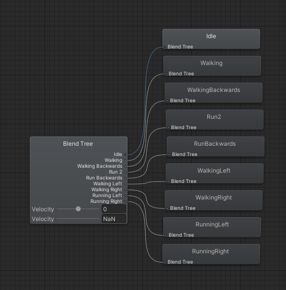

# Simple FPS Controls for Unity

A clean and polished first-person character controller featuring smooth movement, camera controls, and footstep system.

## Features

- Smooth first-person movement with walking and running states
- Camera motion
- Dynamic footstep system with distinct walking/running sounds
- Animator Controller

## Requirements

- Unity 2021.3 or newer
- Character model with animations (if using the animation system)

## Quick Setup Guide

1. **Camera Setup**:
   - Create a Camera as a child of the Player object
   - Clear any Main Camera tags from other cameras in the scene

2. **Scripts Setup**:
   - Add the `PlayerMovement.cs` script to the Player object
   - Configure the following required references:
     - Assign the child Camera to the "Player Camera" field
     - Set up an AudioSource component for footsteps
     - Add footstep sound clips to the respective arrays

3. **Animation Setup** (Optional):
   - If using animations, add the `PlayerAnimatorController.cs` script
   - Set up an Animator component with appropriate animation states
   - Link the PlayerMovement reference in the PlayerAnimatorController

## Controls

- WASD: Movement
- Left Shift: Run
- Space: Jump
- Mouse: Look around

## Customization

### Movement
Adjust the following parameters in the Inspector to customize movement feel:
- `walkSpeed`: Base movement speed
- `runSpeed`: Movement speed while running
- `jumpPower`: Jump height
- `gravity`: Falling speed

### Camera
Fine-tune camera behavior with:
- `lookSpeed`: Mouse sensitivity
- `lookXLimit`: Vertical look angle limit
- `maxTiltAngle`: Camera tilt while turning
- `cameraSmoothing`: Smoothness of camera movement

### Footsteps
Customize the footstep system:
- Add audio clips to `walkFootstepSounds` and `runFootstepSounds` arrays
- Adjust `walkStepInterval` and `runStepInterval` for step timing

## Media

### Gameplay

### Animator Blend Tree Setup

